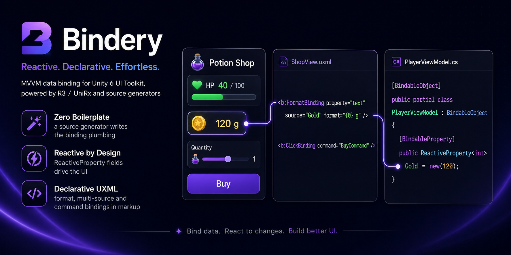

# Bindery

**WPF-style data binding for Unity UI Toolkit.**

WPF-style data binding for Unity 6 UI Toolkit. Source-generated bindable ViewModels from R3/UniRx ReactiveProperty fields, plus declarative UXML bindings for string formatting, multi-source values, and button commands - MVVM without the boilerplate.

[](LICENSE)
[](https://unity.com)
<!-- TODO: add CI badge and OpenUPM badge once the package is published -->

<!-- TODO: hero GIF of slider demo here -->
<!-- Should show: dragging a slider in Play Mode while a FormatBinding label, a MultiBinding label, and a CanExecute-driven Reset button all update live. -->

## Why Bindery

Unity 6 shipped a real runtime data binding system for UI Toolkit: property bags, `dataSource`, `ui:DataBinding`, `CustomBinding`. It works, and it is fast. But writing a bindable ViewModel by hand means implementing `INotifyBindablePropertyChanged`, decorating properties with `[CreateProperty]`, keeping backing fields in sync, and raising change notifications manually for every property.

**By hand, with raw Unity 6 binding:**

```csharp
using Unity.Properties;
using UnityEngine.UIElements;

public class CounterViewModel : INotifyBindablePropertyChanged
{
    public event EventHandler<BindablePropertyChangedEventArgs> propertyChanged;

    private float _sliderValue = 42f;

    [CreateProperty]
    public float SliderValue
    {
        get => _sliderValue;
        set
        {
            if (Mathf.Approximately(_sliderValue, value)) return;
            _sliderValue = value;
            propertyChanged?.Invoke(this,
                new BindablePropertyChangedEventArgs(nameof(SliderValue)));
        }
    }

    // ...repeat for every property
}
```

**With Bindery:**

```csharp
using Bindery;
using R3;

[BindableObject]
public partial class CounterViewModel : BindableObject
{
    [BindableProperty] public ReactiveProperty<float> SliderValue = new(42f);
}
```

A Roslyn source generator emits the property bag, the change notifications, and the disposal tracking at compile time.

Bindery is deliberately a **thin layer over Unity's native binding engine**, not a replacement for it. Older MVVM libraries (built before Unity 6) had to ship their own parallel binding engines and custom element types. Bindery does not:

- Standard UI Toolkit elements keep working unchanged.
- UI Builder stays fully usable.
- Two-way binding uses Unity's built-in `ui:DataBinding`.
- The generated code plugs straight into `Unity.Properties` property bags, the same mechanism Unity uses internally.

## Features

- **Source-generated ViewModels.** Mark `ReactiveProperty<T>` fields with `[BindableProperty]` and get a `ContainerPropertyBag` plus `propertyChanged` wiring, with no reflection in Unity's native binding path.
- **R3 and UniRx support.** The generator auto-detects which library your assembly references (R3 wins if both are present). The Bindery runtime itself has zero hard dependency on either.
- **`FormatBinding`.** One-way binding from a source member through an optional `string.Format` pattern to any string property, declared in UXML.
- **`MultiBinding`.** Multiple source members through one format string, like WPF's `MultiBinding` with `StringFormat`.
- **`ClickBinding`.** Wire a `Button` to an `ICommand` (R3 `ReactiveCommand`), an `Action` property, or a parameterless method. `CanExecute` automatically enables and disables the button.
- **Generated change hooks.** Optional `partial void On<Name>Changed(T newValue)` callbacks per property.
- **Compile-time diagnostics.** Clear errors (BG0001 to BG0004) when a class is missing `partial`, the base class, or a reactive library.
- **Deterministic disposal.** `BindableObject` implements `IDisposable` and tracks every subscription and `ReactiveProperty` it creates.

## Requirements

- Unity 6 or newer (the runtime data binding system is Unity 6 only).
- One reactive library: [R3](https://github.com/Cysharp/R3) (recommended) or [UniRx](https://github.com/neuecc/UniRx).

## Installation

1. Install via Unity Package Manager using the git URL:

   ```
   https://github.com/USER/Bindery.git
   ```

   <!-- TODO: replace with the final repo URL -->

2. Install R3 via [NuGetForUnity](https://github.com/GlitchEnzo/NuGetForUnity) or OpenUPM (or UniRx, if you prefer). The source generator detects whichever one your assembly references.

3. That is it. The source generator ships inside the package as a DLL labeled `RoslynAnalyzer`, so Unity picks it up automatically; there is nothing to configure.

### Don't trust the DLL? Verify it

The generator binary is built deterministically, so you can reproduce it byte for byte from the source in this repository:

```
cd SourceGenerator~
dotnet build -c Release
```

The build uses the .NET SDK version pinned in `SourceGenerator~/global.json` and hashes identically on any machine. Compare your build against the shipped one:

```
sha256sum SourceGenerator~/bin/Release/netstandard2.0/BindablePropertyGenerator.dll Runtime/Analyzers/BindablePropertyGenerator.dll
```

CI runs this exact check on every push, so the committed DLL can never silently diverge from the committed source. See `.github/workflows/verify-generator.yml`.

## Quick start

Three files: a ViewModel, a MonoBehaviour that assigns the data source, and a UXML document.

**1. The ViewModel**

```csharp
using Bindery;
using R3;

[BindableObject]
public partial class BindingTestData : BindableObject
{
    [BindableProperty] public ReactiveProperty<float> SliderValue = new(42f);
    [BindableProperty] public ReactiveProperty<float> MaxValue    = new(60f);

    public ReactiveCommand ResetCommand { get; }

    public BindingTestData()
    {
        ResetCommand = SliderValue.Select(v => v > 50f)
                                  .ToReactiveCommand(initialCanExecute: false);
    }
}
```

**2. The MonoBehaviour**

```csharp
using UnityEngine;
using UnityEngine.UIElements;

[RequireComponent(typeof(UIDocument))]
public class BindingTest : MonoBehaviour
{
    private readonly BindingTestData _data = new();

    private void OnEnable()
    {
        GetComponent<UIDocument>().rootVisualElement.dataSource = _data;
    }

    private void OnDestroy()
    {
        _data.Dispose();
    }
}
```

**3. The UXML**

```xml
<ui:UXML xmlns:ui="UnityEngine.UIElements" xmlns:b="Bindery">
    <ui:Slider name="test-slider" label="Slider" value="42" high-value="100">
        <Bindings>
            <ui:DataBinding property="value" data-source-path="SliderValue" binding-mode="TwoWay" />
        </Bindings>
    </ui:Slider>
    <ui:Label name="test-label" text="Value: 42.0">
        <Bindings>
            <b:FormatBinding property="text" source="SliderValue" format="Value: {0:F1}" />
        </Bindings>
    </ui:Label>
    <ui:Button name="test-button" text="Reset">
        <Bindings>
            <b:ClickBinding property="name" command="ResetCommand" />
        </Bindings>
    </ui:Button>
</ui:UXML>
```

Drag the slider: the two-way `ui:DataBinding` pushes the value into `SliderValue`, the `FormatBinding` label updates, and the Reset button enables itself once the value passes 50 (driven by `ResetCommand.CanExecute`).

Note the namespace declaration `xmlns:b="Bindery"` on the root element; that is what makes the `b:` prefix resolve.

## Bindings reference

All Bindery bindings derive from Unity's `CustomBinding` and share the same lifecycle:

- The data source is resolved **hierarchically**: the binding walks up the visual tree to the nearest ancestor with a `dataSource` set.
- Until a data source appears, the binding reports `Pending` and retries; no errors are spammed while your scene is still loading.
- On a configuration mistake (missing attribute, unknown member, wrong property type) the binding logs **one** clear error and reports `Failure`.
- All event subscriptions are released in `OnDeactivated` (element detached or binding cleared).
- If the data source is replaced at runtime, the binding tears down and re-binds against the new source automatically.

### FormatBinding

One-way: reads a source member, optionally applies a `string.Format` pattern, and writes the result to the element property the binding is registered on.

```xml
<ui:Label text="0">
    <Bindings>
        <b:FormatBinding property="text" source="SliderValue" format="Value: {0:F1}" />
    </Bindings>
</ui:Label>
```

| Attribute  | Required | Description |
|------------|----------|-------------|
| `property` | yes      | The element property to write to (for example `text`). Must be string-typed. |
| `source`   | yes      | Field or property name on the data source to read from. `ReactiveProperty<T>` members are unwrapped to `.Value` automatically. |
| `format`   | no       | `string.Format` pattern with the value as `{0}`. Omit to use plain `ToString()`. |

Behavior notes:

- Formatting always uses `InvariantCulture`, so output does not vary with the OS locale.
- The target property must be assignable from `string`; binding to a non-string property is a `Failure` with an explanatory error.

### MultiBinding

One-way: reads N source members, passes them all to one `string.Format` call, and writes the result. The WPF equivalent is `MultiBinding` with `StringFormat`.

```xml
<ui:Label text="42 / 100">
    <Bindings>
        <b:MultiBinding property="text" format="{0:F0} / {1:F0}">
            <sources>
                <b:Source path="SliderValue" />
                <b:Source path="MaxValue" />
            </sources>
        </b:MultiBinding>
    </Bindings>
</ui:Label>
```

| Attribute / element | Required | Description |
|---------------------|----------|-------------|
| `property`          | yes      | The element property to write to. Must be string-typed. |
| `format`            | no       | `string.Format` pattern; `{0}` is the first source, `{1}` the second, and so on. Omit to concatenate values. |
| `<sources>` with `<b:Source path="..."/>` children | yes | Ordered list of source members. Order maps directly to format indices. |

Behavior notes:

- The result is recomputed whenever **any** of the listed sources raises a change notification.
- The value buffer is reused across updates, so per-change allocation is avoided.
- Same `InvariantCulture` and string-target rules as `FormatBinding`.

### ClickBinding

Wires a `Button` to a command on the data source.

```xml
<ui:Button text="Reset">
    <Bindings>
        <b:ClickBinding property="name" command="ResetCommand" />
    </Bindings>
</ui:Button>
```

| Attribute  | Required | Description |
|------------|----------|-------------|
| `property` | yes      | Registration slot required by UI Toolkit's binding system; `name` is a safe placeholder. ClickBinding does not write to it. |
| `command`  | yes      | Name of the command member on the data source. |

Three command shapes are supported, checked in this order:

1. **`ICommand` property.** Click calls `Execute(null)`, and `CanExecuteChanged` automatically drives `SetEnabled` on the button. R3's `ReactiveCommand` implements `ICommand`, so this works out of the box with R3.
2. **`Action` property.** Invoked on click.
3. **Parameterless `void` method.** Invoked on click.

> **Note:** UniRx's `ReactiveCommand` does **not** implement `ICommand`, so the automatic CanExecute enable/disable is R3 only. With UniRx, expose an `Action` or a method instead and manage the button state yourself.

ClickBinding fails (with a logged error) if attached to anything other than a `Button`.

## The generated code

For each `[BindableObject]` class, the generator emits a partial class containing roughly:

```csharp
// <auto-generated/>
public partial class BindingTestData
{
    // Registers the property bag once per type.
    private static readonly bool _s_propertyBagInit = RegisterPropertyBag_BindingTestData();

    // Optional hook: implement this in your own partial to react to changes.
    partial void OnSliderValueChanged(float newValue);

    protected override void InitBindings()
    {
        base.InitBindings();
        Track(SliderValue); // disposed together with the object
        Track(SliderValue.Skip(1).Subscribe(v =>
        {
            Notify("SliderValue");
            OnSliderValueChanged(v);
        }));
        // ...one block per [BindableProperty] field
    }

    // Unity.Properties property bag: native bindings read and write
    // ReactiveProperty.Value directly, no reflection involved.
    sealed class BindingTestDataPropertyBag : ContainerPropertyBag<BindingTestData> { /* ... */ }
}
```

The `partial void On<Name>Changed(T newValue)` hook is free to implement or ignore; if you do not implement it, the compiler erases the call entirely. `Skip(1)` suppresses the initial emission that `ReactiveProperty` fires on subscribe, so you are only notified about actual changes.

Property names are the PascalCase form of the field name: `_sliderValue`, `sliderValue`, and `SliderValue` all bind as `SliderValue` in UXML.

> **Warning: assign `[BindableProperty]` fields with field initializers, not in the constructor.**
>
> ```csharp
> // Correct
> [BindableProperty] public ReactiveProperty<float> Speed = new(10f);
>
> // Wrong: the field is still null when bindings are wired
> [BindableProperty] public ReactiveProperty<float> Speed;
> public MyViewModel() { Speed = new(10f); }
> ```
>
> `InitBindings()` runs from the `BindableObject` base constructor, which executes **before** your derived constructor body. Fields assigned inside the constructor are still null at that point; the generated code detects this and logs an error at runtime, but the binding for that property will not work.

## Diagnostics

The source generator reports these diagnostics at compile time:

| ID     | Severity | Meaning |
|--------|----------|---------|
| BG0001 | Error    | `[BindableObject]` classes exist but neither R3 nor UniRx is referenced by the assembly. |
| BG0002 | Error    | The class is marked `[BindableObject]` but is not declared `partial`. |
| BG0003 | Error    | The class is marked `[BindableObject]` but does not inherit from `Bindery.BindableObject`. |
| BG0004 | Warning  | A `[BindableProperty]` field is not a `ReactiveProperty<T>` and will be ignored. |

## Disposal

`BindableObject` implements `IDisposable`. Disposing it disposes everything the generated code tracked: each `ReactiveProperty` field and each change-notification subscription. Disposal is idempotent.

If your ViewModel creates extra disposables (commands built in the constructor, derived observables), either pass them to `Track(...)` or override `Dispose(bool)`:

```csharp
protected override void Dispose(bool disposing)
{
    if (disposing)
    {
        ResetCommand.Dispose();
    }
    base.Dispose(disposing); // always call base
}
```

Tie the ViewModel's lifetime to its owner, typically the MonoBehaviour that created it:

```csharp
private void OnDestroy()
{
    _data.Dispose();
}
```

## Performance

- The generated `ContainerPropertyBag` means Unity's **native** bindings (`ui:DataBinding` and anything else going through `Unity.Properties`) read and write your properties with zero reflection.
- Bindery's custom bindings (`FormatBinding`, `MultiBinding`, `ClickBinding`) use reflection **once at setup** to locate members, then compile getter and setter delegates via expression trees for subsequent updates.
- On IL2CPP / AOT platforms, `Expression.Compile` falls back to an interpreter rather than emitting native code, so the compiled-delegate fast path is a JIT-platform optimization. Custom bindings still work correctly on IL2CPP; they are just not as fast there. Benchmarks are pending.

<!-- TODO: benchmark table (Mono JIT vs IL2CPP, native binding vs FormatBinding vs hand-written) -->

## Comparison

| | Bindery | UnityMvvmToolkit | Raw Unity 6 binding |
|---|---|---|---|
| Binding engine | Unity's native runtime binding | Own parallel binding engine (predates Unity 6) | Unity's native runtime binding |
| UI elements | Standard UI Toolkit elements | Custom bindable element types | Standard UI Toolkit elements |
| UI Builder | Fully usable | Limited by custom elements | Fully usable |
| ViewModel boilerplate | Generated from `ReactiveProperty` fields | Manual, or a paid source generator | Manual (`[CreateProperty]`, `INotifyBindablePropertyChanged`, notify calls) |
| Maintenance | Active | Largely inactive since 2023 | Maintained by Unity |
| Formatting / multi-source / commands in UXML | Yes (`FormatBinding`, `MultiBinding`, `ClickBinding`) | Yes (own syntax) | No, write a `CustomBinding` yourself |

UnityMvvmToolkit was a solid solution for its time; it simply targets a Unity that did not yet have a native binding system. If you are on Unity 6, building on the native engine avoids maintaining a parallel infrastructure entirely. And if you are happy writing the `INotifyBindablePropertyChanged` plumbing by hand, raw Unity 6 binding needs no library at all; Bindery just deletes that plumbing.

## Roadmap

Planned, in no particular order. Contributions and design discussions are welcome, open an issue first for anything sizable.

- Collection binding: `ObservableCollection` to `ListView` / `MultiColumnListView`.
- Async commands (R3 `ReactiveCommand` with async handlers, busy-state binding).
- Two-way value converters and integration with Unity's `ConverterGroup`.
- UI Builder integration: property dropdowns instead of typing member names.
- Validators and validation-state styling.

## License

[MIT](LICENSE)

<!-- TODO: screenshots of UI Builder usage and the demo scene -->
